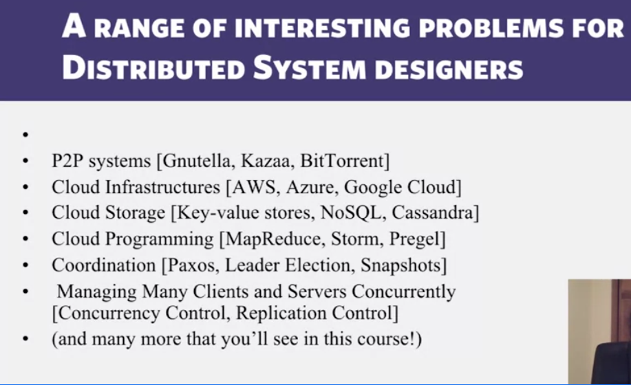

## First, let's define an Operating system
The OS is a system software layer that sits between the hardware and other programs. 
Manages machines resources, multiplexes those resources, and exposes interfaces to the programs that demand them.
Every machine has an OS of varying capabilities and formfactors
Linux,  macOS, Windows, IOS, TinyOS, Android, etc. 

Key facts:
- user interface to hardware (manage peripherals)
- Absstraction (own processes and file system, but still serve that to user)
- Own the resource manager (actual storage & memory allocation, task scheduling, etc.)
- If device has means of communication (largely networking) the OS usually owns that process on the machine.

So OSs (Linux is a great example) are split into a kernel:
    The privilaged core of the OS and the only thing that can touch hardware, CPU's control state, etc.
    Rest of the OS is the client, and that funnels through the kernel to perform functionality. (Linux is the kernel, Fedora or arch are the distros built on top)

# Distributed systems
### Examples of distributed systems
- datacenters
- the internet
- P2P system (BitTorrent)
- client --> server

## Defintion of distributed systems
First defintion: (is largely wrong, just framing)
Distributed system: A set of independent (likely heterogeneous) machines whose distribution is transparent to the user so that the system appears to be one local machine. (the end, not technical user.)
This is in contrast to a network, where the user is aware there are many machines interacting with each other and some of the complexities involves such as load balancing or storage replication. Not transparent. 
Distributed systems usually involve a client-server organization

This framing and distinguishing between a distributed system and a networked system is likely helpful for the class. Good to have terms for each for the class. 
**I would push back on it conceptually though**. Both what they have described as a "distributed system" (which is essentially what a cloud architecture is in modern standards). And, what they have described as a networked system, are actually both types of distributed systems.
**The professor also said the definion provided above is wrong** but he pointed out that "appears as one local machine" is a bas framing, because many distrubted systems are obviously many machines
He also outlined that P2P systems are a type of networked system but do not have a client-server architecture

## The actual, working definition
**A distributed system is a collection of entities, each of which is autonomous, programmable, asynchronous and failure-prone, and which communicate through an unreliable communication medium.**

- entities      = processes/programs
- autonomous    = indenependent from one another
- programmable  = where initally programmed, and can be retooled or refactored
- asynchronous  = each process/entity runs on its own clock. Each entity does not show the same time
- failure prone = each entity (or underlying hardware) may crash at any time / recover
- comm medium   = these entities are communicating with each other over a networked system. That network may drop packets, delay returns, etc. (wired or wireless too)

#### Our interests for the course too
Algorithms underlying these systems, design and implementation of these systems, maintenance, and study from a theory perspective.
#### also, remember process from week 1
The stack, heap, registers, program counter, etc. are all present in this defintiion of an entity.

